# 基于图像分割的A4纸矫正

## 实验环境

mingw

**编译指令：**

```shell
> mingw32-make run
```

## 实验内容

输入对于普通A4打印纸的拍摄照片，上面可能有手写笔记或者打印内容，但是拍照时可能角度不正。

通过图像分割的办法获取A4纸的边缘，并进行矫正（长宽为A4纸的比例，裁掉无用的其他内容，只保留完整的A4纸张）。

## 实验过程

A4纸矫正的算法分为以下步骤：

1. 将图片进行压缩

   > 一方面可以加快代码的运行速度，另一方面可以降噪（模糊），更方便使用阈值法进行图像识别

2. 获得灰度图像

3. 用过Otsu算法获得图像分割的阈值

4. 根据阈值进行边缘提取

5. 根据提取了边缘的二值图像使用Hough变换进行边缘检测，以获得A4值的四个角的坐标

6. 对角坐标根据其坐标值进行排序（识别出左上、右上、左下、右下各自对应哪一个点）

7. 获得将A4纸从原图位置映射到裁剪后的位置的但应变换矩阵

8. 使用单应矩阵进行投影变换获得矫正结果

### 准备工作

1. 图像压缩：

   ```cpp
   smallHeight = img.height() * COMPRESSIONRATIO;
   smallWidth = img.width() * COMPRESSIONRATIO;
   img.resize(smallWidth, smallHeight);
   ```

   这里压缩到原图大小的20%

2. 变为灰度图像：

   复用Canny边缘检测变为灰度图像的函数：

   ```cpp
   cimg_forXY(grayscaled, i, j) {
       int r = grayscaled(i, j, 0, 0);
       int g = grayscaled(i, j, 0, 1);
       int b = grayscaled(i, j, 0, 2);
       int gray = (int)(r * 0.2126 + g * 0.7152 + b * 0.0722);
       grayscaled(i, j, 0, 0) = gray;
       grayscaled(i, j, 0, 1) = gray;
       grayscaled(i, j, 0, 2) = gray;
   }
   ```


### 使用Otsu方法获得图像分割的阈值

1. 统计256个灰度级别的出现次数

   ```cpp
   cimg_forXY(grayImg, x, y) {
       pixelCount[grayImg(x,y,0,0)]++;
   }
   ```

2. 计算256个灰度级别的比例并求得最大比例以及最大比例对应的灰度值

   ```cpp
   float maxPixelRatio = 0.0;
   int maxPixelValue = 0;
   for(int i = 0; i < 256; i++) {
       pixelRatio[i] = (double)pixelCount[i]/(smallWidth*smallHeight);
       if(pixelRatio[i] > maxPixelRatio) {
           maxPixelRatio = pixelRatio[i];
           maxPixelValue = i;
       }
   }
   ```

3. 假设属于前景的像素点占整幅图像比例为$\omega_0$，平均灰度为$\mu_0$. 背景像素占整幅图像的比为$\omega_1$，平均灰度为$\mu_1$。整幅图像的平均灰度为$\mu$，类间方差为$g$。

   对于可能的阈值i作为循环变量在(0,255)范围内遍历，对于每个像素的灰度值(0,255)在内层循环中用j遍历，根据j,i的大小关系确定其为前景或背景。

   ```cpp
   for (int j = 0; j < 256; j++)
   {
       if (j <= i)   //背景部分  
       {
           omega0 += pixelRatio[j];
           mu0tmp += j * pixelRatio[j];
       }
       else        //前景部分  
       {
           omega1 += pixelRatio[j];
           mu1tmp += j * pixelRatio[j];
       }
   }
   ```

   一轮j从(0,255)遍历完毕后，计算出前景和背景的平均灰度，以及整幅图像的平均灰度。并计算方差：

   ```cpp
   mu0 = mu0tmp / omega0;
   mu1 = mu1tmp / omega1;
   u = mu0tmp + mu1tmp;
   variance = omega0 * pow((mu0 - u), 2) + omega1 * pow((mu1 - u), 2);
   ```

   将方差最大的阈值i作为图像分割的阈值。

   ```cpp
   if (variance > varianceMax)
   {
       varianceMax = variance;
       threshold = i;
   }
   ```


### 根据阈值进行边缘提取

由于白纸部分存在阴影而背景部分偶尔也会存在亮点，根据每个像素的八邻域在前景和背景的像素点个数判断当前点是否真的属于前景/背景。这里使用的是当八邻域中有四个以上为背景，则该点为背景；若八邻域中有四个以上像素点为前景，则该点为前景。

```cpp
for(int i = 1; i < smallWidth - 1; i++ ) {
    for (int j = 1; j < smallHeight - 1; j++) {
        // 上、下、左、右
        moreThanThreshold = 0;
        lessThenThreshold = 0;
        if(grayImg(i,j-1,0,0) <= threshold) {
            lessThenThreshold++;
        } else {
            moreThanThreshold++;
        }
        if(grayImg(i,j+1,0,0) <= threshold) {
            lessThenThreshold++;
        } else {
            moreThanThreshold++;
        }
        if(grayImg(i-1,j,0,0) <= threshold) {
            lessThenThreshold++;
        } else {
            moreThanThreshold++;
        }
        if(grayImg(i+1,j,0,0) <= threshold) {
            lessThenThreshold++;
        } else {
            moreThanThreshold++;
        }
        if(grayImg(i-1,j-1,0,0) <= threshold) {
            lessThenThreshold++;
        } else {
            moreThanThreshold++;
        }
        if(grayImg(i-1,j+1,0,0) <= threshold) {
            lessThenThreshold++;
        } else {
            moreThanThreshold++;
        }
        if(grayImg(i+1,j-1,0,0) <= threshold) {
            lessThenThreshold++;
        } else {
            moreThanThreshold++;
        }
        if(grayImg(i+1,j+1,0,0) <= threshold) {
            lessThenThreshold++;
        } else {
            moreThanThreshold++;
        }
        if(moreThanThreshold > 4) {
            // 若八邻域一半以上均为白色，则说明该点为白纸
            grayImg(i, j, 0, 0) = 255;
            grayImg(i, j, 0, 1) = 255;
            grayImg(i, j, 0, 2) = 255;
        } else if(lessThenThreshold > 4) {
            grayImg(i, j, 0, 0) = 0;
            grayImg(i, j, 0, 1) = 0;
            grayImg(i, j, 0, 2) = 0;
        }
    }
}
```

分割后（分割结果为底色为黑色，白纸为白色），用同样的方法遍历每个像素点的八邻域，如果像素点的八邻域存同时存在前景色和背景色，则视作边缘：

```cpp
if(lessThenThreshold < 8 && moreThanThreshold < 8) {
    // 描边
    temp(i, j, 0, 0) = 255;
    temp(i, j, 0, 1) = 255;
    temp(i, j, 0, 2) = 255;
}
```

> 代码和上一步相同，只有最后一步不同

### 对于四个角进行排序

通过计算每个两个点的距离的方法计算出距离最小的两组点（是A4纸两个宽边的定点），根据坐标的相对位置先将上边缘和下边缘的两组定点计算出，然后根据没组定点坐标的x（左右）确定具体为四个点中哪一个：

```cpp
// 获得距离最小的两组点（在pair中存储了点在数组中的下标）
for (int i = 0; i < points.size(); i++) {
    for(int j = i+1; j < points.size(); j++) {
        // 计算距离
        double dis = sqrt(pow(points[i].first - points[j].first, 2) + pow(points[i].second - points[j].second, 2));
        if(dis < minDistance1) {
            minDistance2 = minDistance1;
            min2.first = min1.first;
            min2.second = min1.second;
            // 最小
            minDistance1 = dis;
            min1.first = i;
            min1.second = j;
        } else if (dis < minDistance2) {
            // 倒数第二小
            minDistance2 = dis;
            min2.first = i;
            min2.second = j;
        }
    }
}
```

根据坐标的相对位置进行分配：

```cpp
if(min(points[min1.first].second, points[min1.second].second) < min(points[min2.first].second, points[min2.second].second)) {
    // 则min1对应的两个点为上边缘
    // 左上
    point1.first = points[min1.first].first < points[min1.second].first ? points[min1.first].first : points[min1.second].first;
    point1.second = points[min1.first].first < points[min1.second].first ?  points[min1.first].second : points[min1.second].second;
    // 右上
    point3.first = points[min1.first].first < points[min1.second].first ? points[min1.second].first : points[min1.first].first;
    point3.second = points[min1.first].first < points[min1.second].first ? points[min1.second].second : points[min1.first].second;
    // 左下
    point2.first = points[min2.first].first < points[min2.second].first ? points[min2.first].first : points[min2.second].first;
    point2.second = points[min2.first].first < points[min2.second].first ? points[min2.first].second : points[min2.second].second;	
    // 右下
    point4.first = points[min2.first].first < points[min2.second].first ? points[min2.second].first : points[min2.first].first;
    point4.second = points[min2.first].first < points[min2.second].first ? points[min2.second].second : points[min2.first].second;	
} else {
    // min2对应的两个点为上边缘
    // 左上
    point1.first = points[min2.first].first < points[min2.second].first ? points[min2.first].first : points[min2.second].first;
    point1.second = points[min2.first].first < points[min2.second].first ? points[min2.first].second : points[min2.second].second;	
    // 左下
    point2.first = points[min1.first].first < points[min1.second].first ? points[min1.first].first : points[min1.second].first;
    point2.second = points[min1.first].first < points[min1.second].first ?  points[min1.first].second : points[min1.second].second;
    // 右上
    point3.first = points[min2.first].first < points[min2.second].first ? points[min2.second].first : points[min2.first].first;
    point3.second = points[min2.first].first < points[min2.second].first ? points[min2.second].second : points[min2.first].second;	
    // 右下
    point4.first = points[min1.first].first < points[min1.second].first ? points[min1.second].first : points[min1.first].first;
    point4.second = points[min1.first].first < points[min1.second].first ? points[min1.second].second : points[min1.first].second;
}
```

目前为止的处理都是在缩小后的图片上处理，但实际上需要即将他映射到原始大小的图片上进行A4纸的矫正，因而四个边缘点需要除以在压缩图片时使用的压缩率：

```cpp
for(int i = 0; i < points.size(); i++) {
    points[i].first /= COMPRESSIONRATIO;
    points[i].second /=COMPRESSIONRATIO;
}
```

### 获得投影变换的单应矩阵

这里的方法和上次作业RANSAC获得单应矩阵的方法相同，我将上一步计算出的拍好顺序的四个点作为变换前的四组点，将图片的四个顶点作为变换后的目标点，构建了四组点的映射关系：

```cpp
double data[64];
// 映射后坐标
double vecB[8] = {0,0,0,(double)height-1, (double)width-1,0,(double)width-1,(double)height-1};
for (int i = 0; i < 64; i += 16) {
    data[i] = data[i + 11] = points[i/16].first;
    data[i + 1] = data[i + 12] = points[i/16].second;
    data[i + 2] = data[i + 13] = 1;
    data[i + 3] = data[i + 4] = data[i + 5] = data[i + 8] = data[i + 9] = data[i + 10] = 0;
    data[i + 6] = -vecB[i/16*2] * points[i/16].first;
    data[i + 7] = -vecB[i/16*2] * points[i/16].second;
    data[i + 14] = -vecB[i/16*2+1] * points[i/16].first;
    data[i + 15] = -vecB[i/16*2+1] * points[i/16].second;
}
Matrix A(data, 8, 8);
Matrix b(vecB, 8, 1);
Matrix result = A.Inverse()*b;

double Hdata[9];
for (int i = 0; i < 8; i++) {
    Hdata[i] = result.item[i];
}
Hdata[8] = 1;
Matrix H(Hdata, 3, 3);
```

利用Matrix作为矩阵运算类，直接得到单应矩阵H。

### 进行A4纸矫正

首先建立和原图大小相等的全黑图片，对其每个像素点进行遍历，使用向前映射的方法，进行H矩阵的逆变换找到在变换前图片中对应的点（这一步是为了避免出现空点的问题）。

```cpp
cimg_forXY(result, x, y) {
    double xy[3] = {x,y,1};
    const Matrix xyM(xy,3,1);
    Matrix xyPrime = H.Inverse()*xyM;
    if(xyPrime.item[0]/xyPrime.item[2] >=0 && xyPrime.item[0]/xyPrime.item[2] < width && xyPrime.item[1]/xyPrime.item[2] >=0 && xyPrime.item[1]/xyPrime.item[2]<height){
        result(x,y,0,0) = origin(xyPrime.item[0]/xyPrime.item[2], xyPrime.item[1]/xyPrime.item[2],0,0);
        result(x,y,0,1) = origin(xyPrime.item[0]/xyPrime.item[2], xyPrime.item[1]/xyPrime.item[2],0,1);
        result(x,y,0,2) = origin(xyPrime.item[0]/xyPrime.item[2], xyPrime.item[1]/xyPrime.item[2],0,2);

    }		
}
```

## 实验结果

根据图像分割检测边缘的结果：

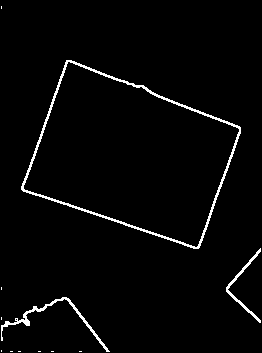

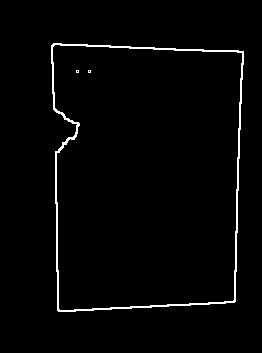

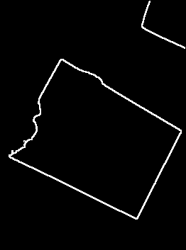

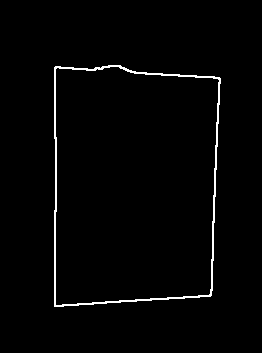

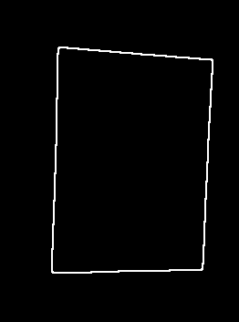

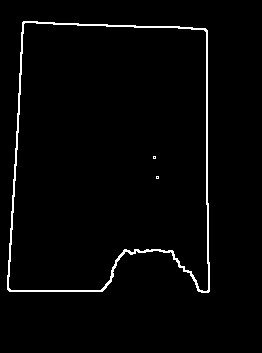

边缘检测的结果：

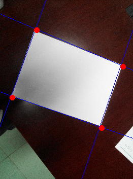

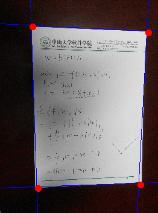

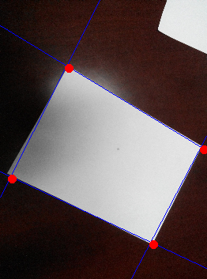

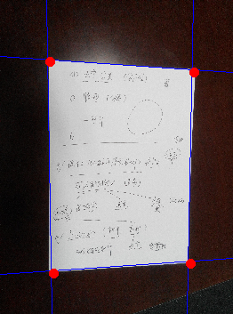

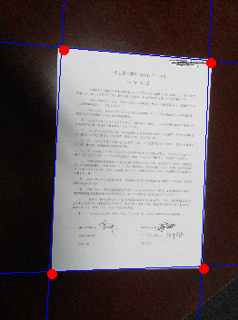

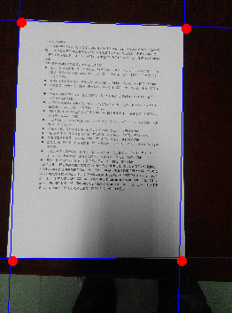

矫正结果：


